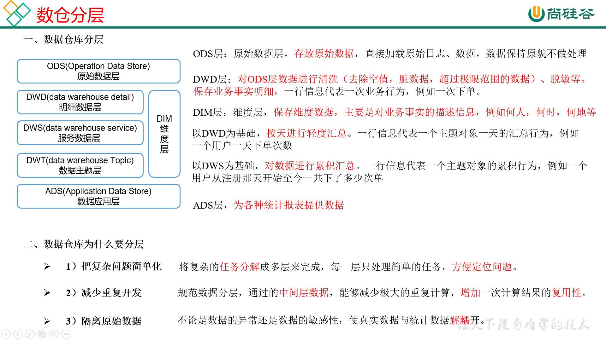

# 数仓分层



---

## 数仓为什么要分层

- 把复杂问题简单：将复杂任务分为多层来完成，每一层只处理简单任务，方便定位问题。。
- 减少重复开发：规范数据分层，通过的中间层数据，能够减少极大的重复运算，增加一次计算结果的复用性。
- 隔离原始数据：不论是数据异常还是数据的敏感性，是真实数据与统计数据解耦开。

---

# 数据集市与数据仓库的区别

​                                                              

---

# 范式概念


---

# 关系建模

三范式

- 第一范式核心原则是：**属性不可切割**
- 第二范式核心原则是：**不能存在非主键部分函数依赖主键**
- 第三范式核心原则是：**不能存在非主键传递函数依赖主键**

# 维度建模

以数据分析为出发点，不遵循三范式，数据存在一定冗余。维度模型面向业务，将业务用事实表和维度表呈现出来。表结构简单，故查询简单，查询效率高。

## 维度表和事实表

- 维度表：一般对事实的描述信息。每一张维度表对应现实世界中的一个对象和概念。例如用户、商品、日期、地区。

  >- 维度表范围广，具有多个属性，列比较多
  >- 更事实表相比，行相对较少
  >- 内容相对固定：编码表

- 事实表：维度表的外键加上度量值，通常具有两个和两个以上的外键

  >- 非常大
  >- 内容相对的窄
  >- 经常会发生变化

  1.事务型事实表：以每个事物或事件为单位，会保留所有事务，不会修改，增量同步。例如一个销售订单记录。

  2.周期性快照事实表：不会保留所有数据，只保留固定时间间隔的数据，例如每天或者每月的销售额，或每月的账户余额。全量同步。例如购物车。

  3.累计型快照事实表：累计快照事实表用于跟踪业务事实变化。新增变化同步。例如商品的发货。

## 星型模型 星型模型 星座模型


> 雪花模型对维度表进行规范化


# 数仓建模

## 一、ODS层

###  1.HDFS用户行为数据

- flume-kafka-flume-hdfs

### 2.HDFS业务数据

- SQOOP同步

## 二、DIM层和DWD层

DIM和DWD层构建维度模型，一般采用星型模型，呈现的状态一般为星座模型

**选择业务过程--声明粒度--确认维度--确认事实**

```shell
#!/bin/bash

# 定义变量方便修改
APP=gmall

# 如果是输入的日期按照取输入日期；如果没输入日期取当前时间的前一天
if [ -n "$1" ] ;then
   do_date=$1
else 
   do_date=`date -d "-1 day" +%F`
fi 

echo ================== 日志日期为 $do_date ==================
sql="
load data inpath '/origin_data/$APP/log/topic_log/$do_date' into table ${APP}.ods_log partition(dt='$do_date');
"

hive -e "$sql"

hadoop jar hadoop jar /home/softwares/hadoop-3.1.3/share/hadoop/common/hadoop-lzo-0.4.20.jar com.hadoop.compression.lzo.DistributedLzoIndexer /warehouse/$APP/ods/ods_log/dt=$do_date

```


