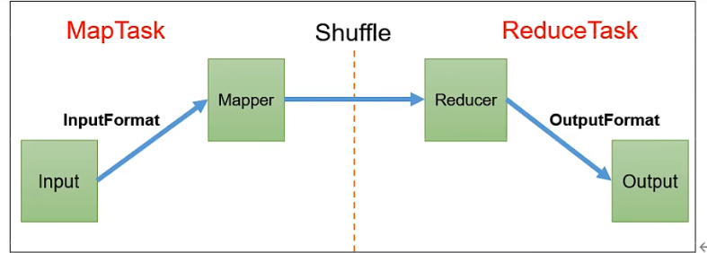
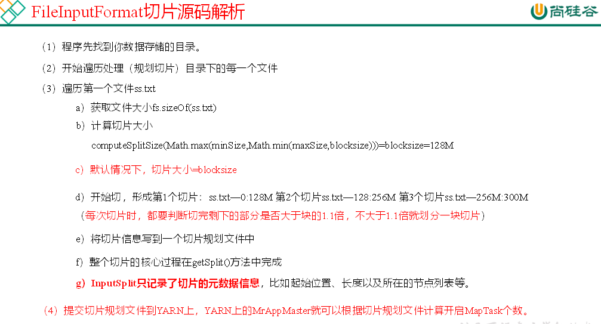
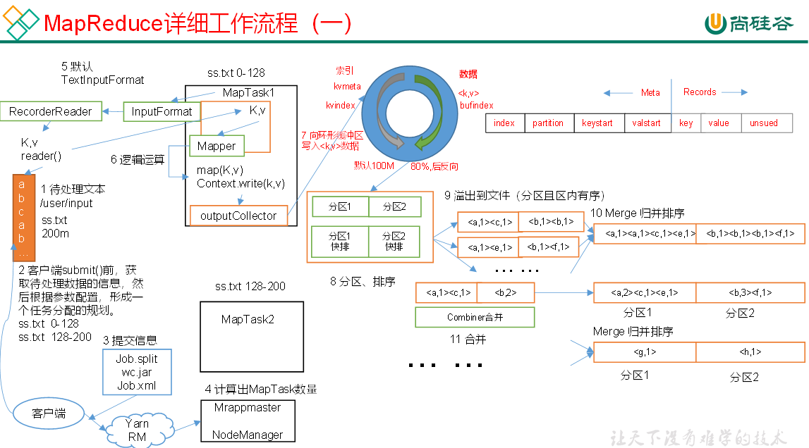
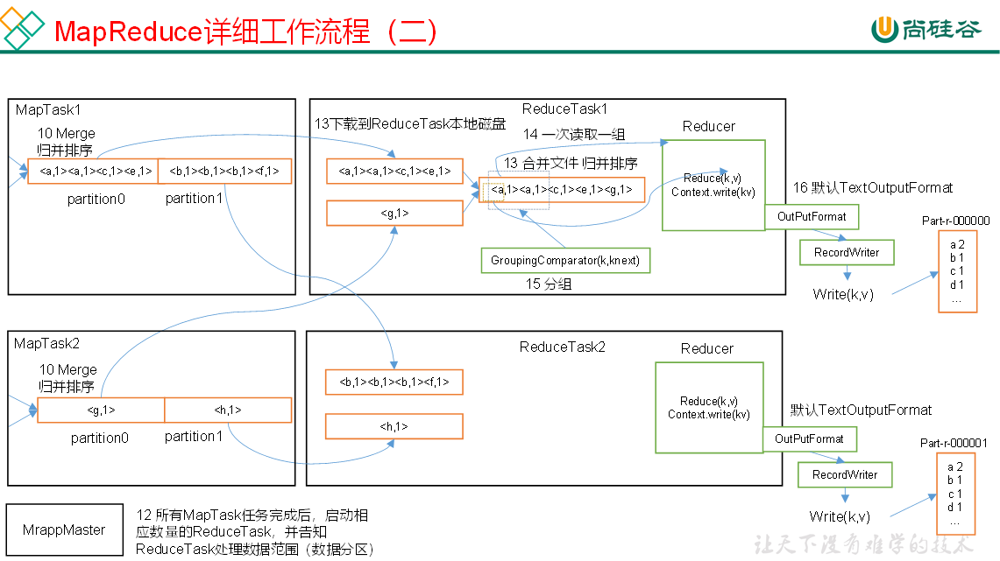
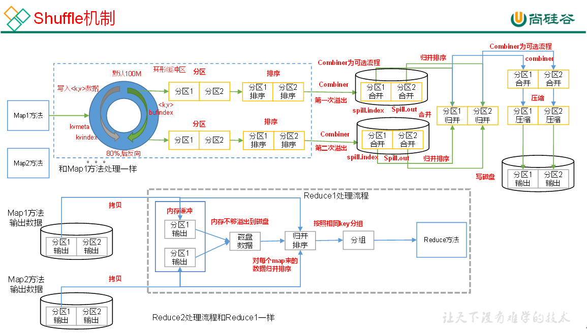
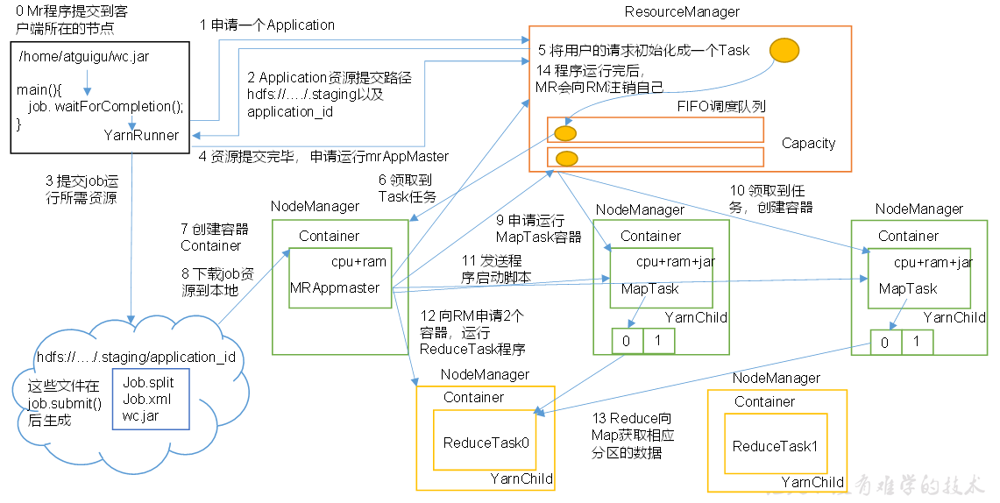
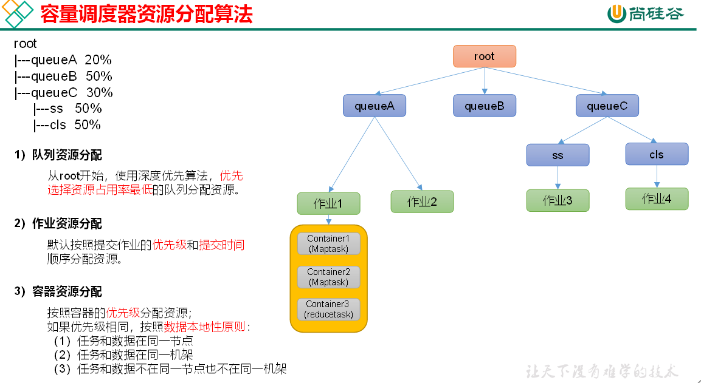
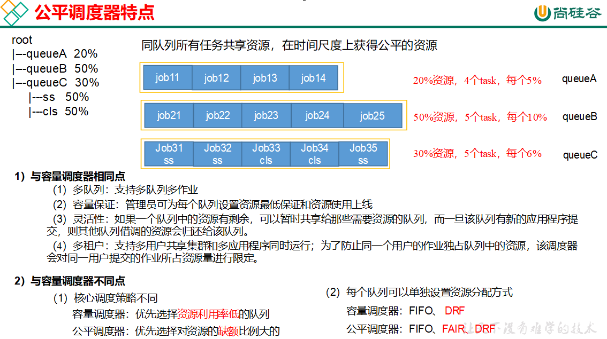

# Hadoop

* 广义上来说，Hadoop通常是指一个更广泛的概念——Hadoop生态圈。
* 狭义上说，Hadoop指Apache这款开源框架，它的核心组件有：
  * HDFS（分布式文件系统）：解决海量数据存储
  * YARN（作业调度和集群资源管理的框架）：解决资源任务调度
  * MAPREDUCE（分布式运算编程框架）：解决海量数据计算

## NameNode

存储文件的元数据,如文件目录结构,文件属性,以及每个文件的块列表和块所在的DataNode

## DataNode

在本地文件系统存储文件块数据,以及块数据的校验

## SecondaryNameNode

每隔一段时间备份NameNode的元数据

## Hadoop特性优点

* 扩容能力（Scalable）：Hadoop是在可用的计算机集群间分配数据并完成计算任务的，这些集群可用方便的扩展到数以千计的节点中。

* 成本低（Economical）：Hadoop通过普通廉价的机器组成服务器集群来分发以及处理数据，以至于成本很低。

* 高效率（Efficient）：通过并发数据，Hadoop可以在节点之间动态并行的移动数据，使得速度非常快。

* 可靠性（Rellable）：能自动维护数据的多份复制，并且在任务失败后能自动地重新部署（redeploy）计算任务。所以Hadoop的按位存储和处理数据的能力值得人们信赖。

## Hadoop集群中Hadoop都需要启动哪些进程，他们的作用分别是什么？

* namenode =>HDFS的守护进程，负责维护整个文件系统，存储着整个文件系统的元数据信息，image+edit-log
* datanode =>是具体文件系统的工作节点，当我们需要某个数据，namenode告诉我们去哪里找，就直接和那个DataNode对应的服务器的后台进程进行通信，由DataNode进行数据的检索，然后进行具体的读/写操作
* secondarynamenode =>一个守护进程，相当于一个namenode的元数据的备份机制，定期的更新，和namenode进行通信，将namenode上的image和edits进行合并，可以作为namenode的备份使用
* resourcemanager =>是yarn平台的守护进程，负责所有资源的分配与调度，client的请求由此负责，监控nodemanager
* nodemanager => 是单个节点的资源管理，执行来自resourcemanager的具体任务和命令
* DFSZKFailoverController高可用时它负责监控NN的状态，并及时的把状态信息写入ZK。它通过一个独立线程周期性的调用NN上的一个特定接口来获取NN的健康状态。FC也有选择谁作为Active NN的权利，因为最多只有两个节点，目前选择策略还比较简单（先到先得，轮换）。
* JournalNode 高可用情况下存放namenode的editlog文件


# HDFS

**定义**:是一个文件系统,用于存储文件,通过目录树来定位文件,其次他是分布式的,由很多服务器联合起来实现功能,集群中的服务各有各自的角色

## 优点

>- 高容错:通过副本来提高容错性
>- 适合处理大数据
>- 可以构建在廉价的机器上,通过多副本机制,提高可靠性

## 缺点

>* 不适合低延时数据访问
>* 无法高效的对大量小文件进行存储
>* 不支持并发写入和文件随机修改

## 组成架构

### NameNode

>* 管理HDFS的名称空间
>
>* 配置副本策略
>
>* 管理数据块的映射信息
>
>* 处理客户端的读写请求

### DataNode

>* 存储实际的数据块
>
>* 执行数据块的读写

### SecondaryNameNode

>* 不是NameNode的热备
>* 辅助NameNode,分担工作量,定期合并Fsimage,和Edits,并推送给NameNode
>
>* 辅助恢复NameNode

### Client客户端

>* 文件切分.文件上传HDFS的时候,Client将文件切分成一个个的块
>
>* 与NameNode交互,获取文件信息位置
>* 与DataNode交互,读取或者写入数据
>* 提供一些命令管理HDFS
>* 通过一些命令访问HDFS

## HDFS文件块大小

HDFS中的文件在物理上是分块存储的,大小可以通过配置参数(dfs.blocksize)来规定,默认是128M

>HDFS的块设置太小,会增加寻址时间,程序一直在找块的位置
>
>HDFS块设置的太大,从磁盘传输的时间会明显大于定位这个块开始位置所需的时间,导致程序处理这块数据的时候非常慢

## HDFS shell 命令

**hdfs dfs** 和  **hadoop fs** 一样

```shell
hadoop fs -mkdir [path]	#创建文件夹
hadoop fs -moveFromLocal [file] [path]	#从本地文件剪切粘贴到HDFS
hadoop fs -put [file] [path]  <=> hadoop fs -copyFromLocal [file] [path]	#从本地文件拷贝粘贴到HDFS
hadoop fs -appendToFile [file]	#往文件追加内容,只能追加
hadoop fs -get [file] [path] <=> hadoop fs -copyToLocal [file] [path]	#从HDFS拷贝粘贴到本地文件
hadoop fs -cat [file]	#获取文件内容
hadoop fs -cp [file] [path] #拷贝文件到另一个路径
hadoop fs -mv [file] [path]	#移动文件到另外一个路径
hadoop fs -tail [file]	#显示文件最后1kb的信息
hadoop fs -rm -r [path]	#递归删除目录和里面的内容
hadoop fs -rm [file] #删除文件
hadoop fs -setrep [file]	#设置HDFS文件中的副本数量
hadoop fs -du -s -h [path]	#目录总大小
hadoop fs -du -h [path]	#目录里面具体文件大小
```

## HDFS写数据流程

1）客户端通过Distributed FileSystem模块向namenode请求上传文件，namenode检查目标文件是否已存在，父目录是否存在。

2）namenode返回是否可以上传。

3）客户端请求第一个 block上传到哪几个datanode服务器上。

4）namenode返回3个datanode节点，分别为dn1、dn2、dn3。

5）客户端通过FSDataOutputStream模块请求dn1上传数据，dn1收到请求会继续调用dn2，然后dn2调用dn3，将这个通信管道建立完成。

6）dn1、dn2、dn3逐级应答客户端。

7）客户端开始往dn1上传第一个block（先从磁盘读取数据放到一个本地内存缓存），以packet为单位（大小为64k），dn1收到一个packet就会传给dn2，dn2传给dn3；dn1每传一个packet会放入一个应答队列等待应答。

8）当一个block传输完成之后，客户端再次请求namenode上传第二个block的服务器。

## HDFS读数据流程

1）客户端通过Distributed FileSystem向namenode请求下载文件，namenode通过查询元数据，找到文件块所在的datanode地址。

2）挑选一台datanode（就近原则，然后随机）服务器，请求读取数据。

3）datanode开始传输数据给客户端（从磁盘里面读取数据输入流，以packet为单位来做校验,大小为64k）。

4）客户端以packet为单位接收，先在本地缓存，然后写入目标文件。

## HDFS小文件问题及解决方案

1.**Hadoop Archive**: Hadoop Archive或者HAR，是一个高效地将小文件放入HDFS块中的文件存档工具，它能够将多个小文件打包成一个HAR文件，这样在减少namenode内存使用的同时，仍然允许对文件进行透明的访问。

2.**sequence file** ：sequence file由一系列的二进制key/value组成，如果为key小文件名，value为文件内容，则可以将大批小文件合并成一个大文件

3.**CombineFileInputFormat**：CombineFileInputFormat是一种新的inputformat，用于将多个文件合并成一个单独的split

## HDFS数据完整性

根据src校验位来确保数据完整性

## 小文件优化

1、从源头干掉，也就是在hdfs上我们不存储小文件，也就是数据上传hdfs的时候我们就合并小文件

2、在FileInputFormat读取入数据的时候我们使用实现类CombineFileInputFormat读取数据，在读取数据的时候进行合并。

## SecondaryNameNode的作用

它的职责是**合并NameNode的edit logs到fsimage文件**


# MapReduce

MapReduce的思想核心是“分而治之”，适用于大量复杂的任务处理场景（大规模数据处理场景）。

Map负责“分”，即把复杂的任务分解为若干个“简单的任务”来并行处理。可以进行拆分的前提是这些小任务可以并行计算，彼此间几乎没有依赖关系。

Reduce负责“合”，即对Map阶段的结果进行全局汇总。



## 优点

>* 易于编程
>* 良好的扩展性
>* 高容错性
>* 适合海量数据

## 缺点

>* 不擅长实时计算
>* 不擅长流式计算
>* 不擅长DAG有向无环图

## MapReduce 往集群提交任务

```shell
 hadoop jar wc.jar com.kevin.MapReduce2.WordCountDrive /input /output
```

**优点** :

* 紧凑:存储空间少;
* 互操作性
* 快速:传输速度快

## MapReduce序列化

内存数据往字节码变化过程叫序列化,反之叫反序列化.

## InputFormat数据输入

### 切片与MapTask并行度决定机制

MapTest个数,决定了Map阶段的任务处理并发度,从而影响整个Job的处理速度.

### MapTaskde的决定机制

**数据块**：**Block**是HDFS物理上把数据分成一块一块。数据块是HDFS存储数据单位。

**数据切片**：**数据切片**只是在逻辑上对输入进行分片，并不会在磁盘上将其切分成片进行存储。数据切片是MapReduce程序计算输入数据的单位，一个切片会对应启动一个MapTask。

>* 一个Job的Map阶段并行度由客户端在提交job时的切片数决定
>* 每一个切片分配一个MapTask并行实例处理
>* 默认情况下,切片大小等于块大小
>* 切片不考虑数据集整体,而是逐个针对每一个文件单独切片



## MapReduce的执行流程

* Map阶段
  * 第一阶段是把输入目录下文件按照一定的标准逐个进行逻辑切片，形成切片规划。默认情况下，Split size = Block size。每一个切片由一个MapTask处理。（getSplits）
  * 第二阶段是对切片中的数据按照一定的规则解析成<key,value>对。默认规则是把每一行文本内容解析成键值对。key是每一行的起始位置(单位是字节)，value是本行的文本内容。（TextInputFormat）
  * 第三阶段是调用Mapper类中的map方法。上阶段中每解析出来的一个<k,v>，调用一次map方法。每次调用map方法会输出零个或多个键值对。
  * 第四阶段是按照一定的规则对第三阶段输出的键值对进行分区。默认是只有一个区。分区的数量就是Reducer任务运行的数量。默认只有一个Reducer任务。
  * 第五阶段是对每个分区中的键值对进行排序。首先，按照键进行排序，对于键相同的键值对，按照值进行排序。比如三个键值对<2,2>、<1,3>、<2,1>，键和值分别是整数。那么排序后的结果是<1,3>、<2,1>、<2,2>。如果有第六阶段，那么进入第六阶段；如果没有，直接输出到文件中。
  * 第六阶段是对数据进行局部聚合处理，也就是combiner处理。键相等的键值对会调用一次reduce方法。经过这一阶段，数据量会减少。本阶段默认是没有的。
* reduce阶段
  * 第一阶段是Reducer任务会主动从Mapper任务复制其输出的键值对。Mapper任务可能会有很多，因此Reducer会复制多个Mapper的输出。
  * 第二阶段是把复制到Reducer本地数据，全部进行合并，即把分散的数据合并成一个大的数据。再对合并后的数据排序。
  * 第三阶段是对排序后的键值对调用reduce方法。键相等的键值对调用一次reduce方法，每次调用会产生零个或者多个键值对。最后把这些输出的键值对写入到HDFS文件中。







## MapReduce的shuffle阶段

每一个Mapper进程都有一个环形的内存缓冲区，用来存储Map的输出数据，这个内存缓冲区的默认大小100MB，当数据达到阙值0.8，也就是80MB的时候，一个后台的程序就会把数据溢写到磁盘中。在将数据溢写到磁盘的过程中要经过复杂的过程，首先要将数据进行分区排序（按照分区号如0，1，2），分区完以后为了避免Map输出数据的内存溢出，可以将Map的输出数据分为各个小文件再进行分区，这样map的输出数据就会被分为了具有多个小文件的分区已排序过的数据。然后将各个小文件分区数据进行合并成为一个大的文件（将各个小文件中分区号相同的进行合并）。




## partitioner

**默认Hash分区**

在进行MapReduce计算时，有时候需要把最终的输出数据分到不同的文件中，比如按照省份划分的话，需要把同一省份的数据放到一个文件中；按照性别划分的话，需要把同一性别的数据放到一个文件中。负责实现划分数据的类称作Partitioner。

### 自定义partitioner

继承partitioner抽象类;

重写getpartition方法;

在Job驱动中设置自定义partitioner


## WritableComparable排序

### 排序概述

排序是MapReduce框架中最重要的操作之一。

MapTask和ReduceTask均会对数据按照key进行排序。该操作属于Hadoop的默认行为。任何应用程序中的数据均会被排序，而不管逻辑上是否需要。

默认排序是按照字典顺序排序，且实现该排序的方法是快速排序。

对于MapTask，它会将处理的结果暂时放到环形缓冲区中，当环形缓冲区使用率达到一定阈值后，再对缓冲区中的数据进行一次快速排序，并将这些有序数据溢写到磁盘上，而当数据处理完毕后，它会对磁盘上所有文件进行归并排序。

对于ReduceTask，它从每个MapTask上远程拷贝相应的数据文件，如果文件大小超过一定阈值，则溢写磁盘上，否则存储在内存中。如果磁盘上文件数目达到一定阈值，则进行一次归并排序以生成一个更大文件；如果内存中文件大小或者数目超过一定阈值，则进行一次合并后将数据溢写到磁盘上。当所有数据拷贝完毕后，ReduceTask统一对内存和磁盘上的所有数据进行一次归并排序。

### 排序分类

**部分排序**:MapReduce根据输入记录的键对数据集排序。保证输出的每个文件内部有序。

**全排序**:最终输出结果只有一个文件，且文件内部有序。实现方式是只设置一个ReduceTask。但该方法在处理大型文件时效率极低，因为一台机器处理所有文件，完全丧失了MapReduce所提供的并行架构。

**辅助排序**：（GroupingComparator分组）:    在Reduce端对key进行分组。应用于：在接收的key为bean对象时，想让一个或几个字段相同（全部字段比较不相同）的key进入到同一个reduce方法时，可以采用分组排序。

**二次排序**:在自定义排序过程中，如果compareTo中的判断条件为两个即为二次排序。

### 自定义排序WritableComparable原理分析

bean对象做为key传输，需要实现WritableComparable接口重写compareTo方法，就可以实现排序.	

### 二次排序

在重写的compareTo方法中加分支即可.

## 区内排序

设置自定义分区,然后实现自定义排序.

## Combiner

每一个map都可能会产生大量的本地输出，Combiner的作用就是对map端的输出先做一次合并，以减少在map和reduce节点之间的数据传输量，以提高网络IO性能。

### 自定义Combiner实现步骤

自定义一个Combiner继承Reducer，重写Reduce方法

在Job驱动类中设置**job.setCombinerClass(WordCountCombiner.class);**

## MapTask工作机制

1. Read阶段,用Inputformat进行读文件
2. Map阶段,自定义的map方法对数据进行处理
3. 收集阶段,map后的数据到环形缓冲区
4. 溢写阶段,环形缓冲区开始溢写,产生溢写文件
5. merge阶段,合并溢写文件

## ReduceTask工作机制

1. copy阶段,reduce先从硬盘拉去所需要的阶段
2. sort阶段,合并文件,并排序
3. Reduce,进行reduce处理,并输出到OutPutFormat

### ReduceTask并行度决定机制

手动进行设置:**job.setNumReduceTask(num)**

默认值是1,所以输出文件是一个

如果数据分布不均匀容易造成在Reduce阶段产生数据倾斜

## 数据倾斜问题优化

1、既然默认的是hash算法进行分区，那我们自定义分区，修改分区实现逻辑，结合业务特点，使得每个分区数据基本平衡

2、既然有默认的分区算法，那么我们可以修改分区的键，让其符合hash分区，并且使得最后的分区平衡，比如在key前加随机数n-key。

3、既然reduce处理慢，我们可以增加reduce的内存和vcore呀，这样挺高性能就快了，虽然没从根本上解决题，但是还有效果

4、既然一个reduce处理慢，那我们可以增加reduce的个数来分摊一些压力呀，也不能根本解决问题，还是有一定的效果。

## 如何能够让Map执行效率最高

尽量减少环形缓冲区flush的次数（减少IO 的使用）

调大环形缓冲区的大小，将100M调更大。

调大环形缓冲区阈值大的大小。

对Map输出的数据进行压缩。（数据在压缩和解压的过程中会消耗CPU）

## 如何能够让Reduce执行效率最高

尽量减少环形缓冲区flush的次数（减少IO 的使用）

尽量将所有的数据写入内存，在内存中进行计算。

## Join

### Join数据倾斜

1. 把小表缓存到内存中:在Mapper的setup阶段,将文件读取到缓存集合中;在Driver驱动类中加入缓存
2. 使用mapjoin

# Yarn

## MapReduce程序在yarn上的执行流程

一：客户端向集群提交一个任务，该任务首先到ResourceManager中的ApplicationManager;

二：ApplicationManager收到任务之后，会在集群中找一个NodeManager，并在该NodeManager所在DataNode上启动一个AppMaster进程，该进程用于进行任务的划分和任务的监控；

三：AppMaster启动起来之后，会向ResourceManager中的ApplicationManager注册其信息（目的是与之通信）；

四：AppMaster向ResourceManager下的ResourceScheduler申请计算任务所需的资源；

五：AppMaster申请到资源之后，会与所有的NodeManager通信要求它们启动计算任务所需的任务（Map和Reduce）；

六：各个NodeManager启动对应的容器用来执行Map和Reduce任务；

七：各个任务会向AppMaster汇报自己的执行进度和执行状况，以便让AppMaster随时掌握各个任务的运行状态，在某个任务出了问题之后重启执行该任务；

八：在任务执行完之后，AppMaster向ApplicationManager汇报，以便让ApplicationManager注销并关闭自己，使得资源得以回收；



 ## Yarn调度器和调度算法

 ### 先进先出调度器（FIFO）

FIFO调度器（First In First Out）：单队列，根据提交作业的先后顺序，先来先服务。

### 容量调度器（Capacity Scheduler）

1、多队列：每个队列可配置一定的资源量，每个队列采用FIFO调度策略。

2、容量保证：管理员可为每个队列设置资源最低保证和资源使用上限

3、灵活性：如果一个队列中的资源有剩余，可以暂时共享给那些需要资源的队列，而一旦该队列有新的应用程序提交，则其他队列借调的资源会归还给该队列。

4、多租户：

​    支持多用户共享集群和多应用程序同时运行。

​    为了防止同一个用户的作业独占队列中的资源，该调度器会对同一用户提交的作业所占资源量进行限定。



### 公平调度器（Fair Scheduler）

（1）多队列：支持多队列多作业

（2）容量保证：管理员可为每个队列设置资源最低保证和资源使用上线

（3）灵活性：如果一个队列中的资源有剩余，可以暂时共享给那些需要资源的队列，而一旦该队列有新的应用程序提交，则其他队列借调的资源会归还给该队列。

（4）多租户：支持多用户共享集群和多应用程序同时运行；为了防止同一个用户的作业独占队列中的资源，该调度器会对同一用户提交的作业所占资源量进行限定。


