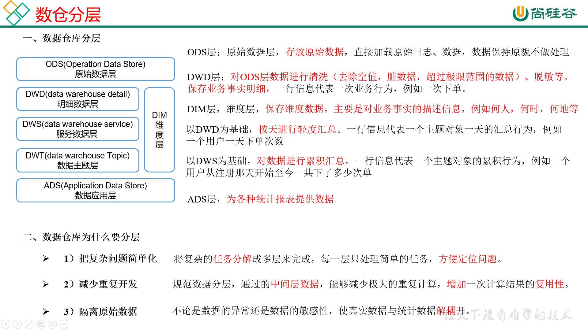
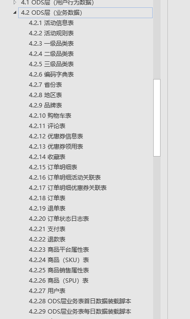
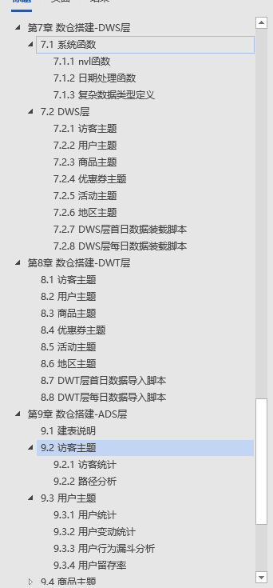

# 数仓分层

## 数仓为什么要分层

- 把复杂问题简单：将复杂任务分为多层来完成，每一层只处理简单任务，方便定位问题。。
- 减少重复开发：规范数据分层，通过的中间层数据，能够减少极大的重复运算，增加一次计算结果的复用性。
- 隔离原始数据：不论是数据异常还是数据的敏感性，是真实数据与统计数据解耦开。

# 关系建模

三范式

- 第一范式核心原则是：**属性不可切割**
- 第二范式核心原则是：**不能存在非主键部分函数依赖主键**
- 第三范式核心原则是：**不能存在非主键传递函数依赖主键**

# 维度建模

以数据分析为出发点，不遵循三范式，数据存在一定冗余。维度模型面向业务，将业务用事实表和维度表呈现出来。表结构简单，故查询简单，查询效率高。

## 维度表和事实表

- 维度表：一般对事实的描述信息。每一张维度表对应现实世界中的一个对象和概念。例如用户、商品、日期、地区。

  >- 维度表范围广，具有多个属性，列比较多
  >- 更事实表相比，行相对较少
  >- 内容相对固定：编码表

- 事实表：维度表的外键加上度量值，通常具有两个和两个以上的外键

  >- 非常大
  >- 内容相对的窄
  >- 经常会发生变化

  1.事务型事实表：以每个事物或事件为单位，会保留所有事务，不会修改，增量同步。例如一个销售订单记录。

  2.周期性快照事实表：不会保留所有数据，只保留固定时间间隔的数据，例如每天或者每月的销售额，或每月的账户余额。全量同步。例如购物车。

  3.累计型快照事实表：累计快照事实表用于跟踪业务事实变化。新增变化同步。例如商品的发货。

## 雪花模型 星型模型 星座模型

当有一个或多个维表没有直接连接到事实表上，而是通过其他维表连接到事实表上时

维度表之间没有关联，当所有维表都直接连接到“ 事实表”上

需要多个事实表共享维度表，因而可以视为星形模型的集合

数据分为日志数据和业务数据,日志数据是通过flume对日志的文件进行监控,并写一个自定义拦截器来解决零点漂移问题,将其写入kafka,再通过flume,将kafka的数据写入hdfs,并把数据使用lzo压缩,业务数据是存储在MySQL中,通过sqoop,把mysql的数据同步到Hdfs,然后就使用Hive创建对应的表格,来搭建ODS,DIM层,ODS使用日期进行分区,然后基于ODS层,对数据进行清洗脱敏等操作构建DWD层,然后基于DWD和DIM搭建DWS层:包含访客主题,用户主题,商品主题,优惠券主题,活动主题,地区主题,对数据进行轻度的汇总,再搭建DWT层,对数据进行累计汇总,之后再基于DWT和DWS层为ADS层提供相应的可视化统计.再编写数仓的数据同步的Shell脚本,并通过Azkaban进行调度操作,最后通过django+pyechars进行可视化展示.

