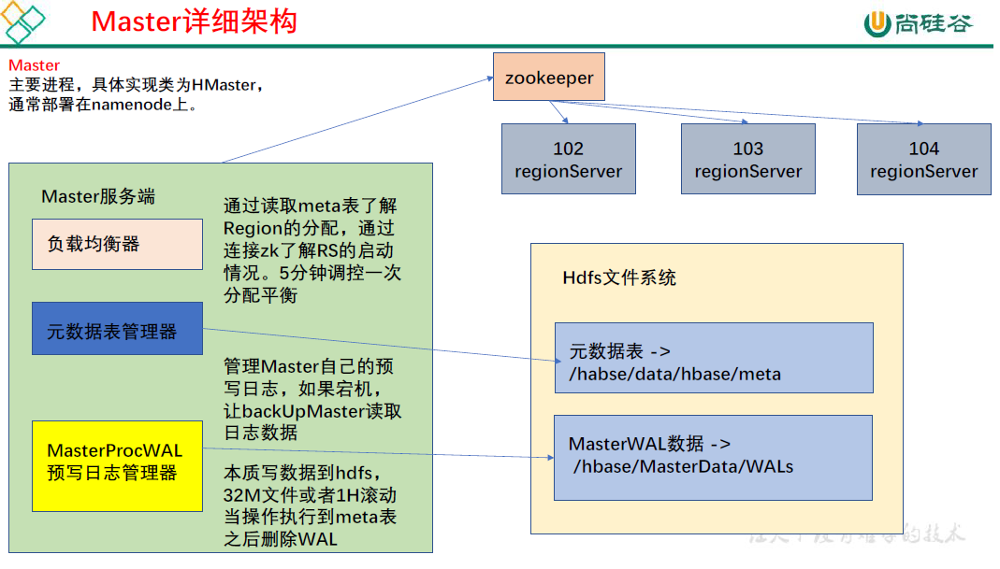
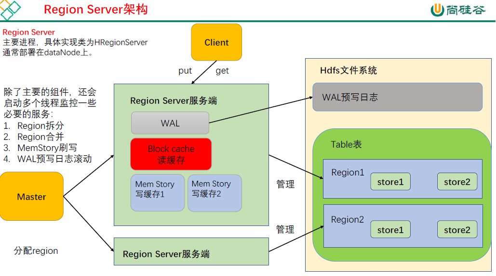
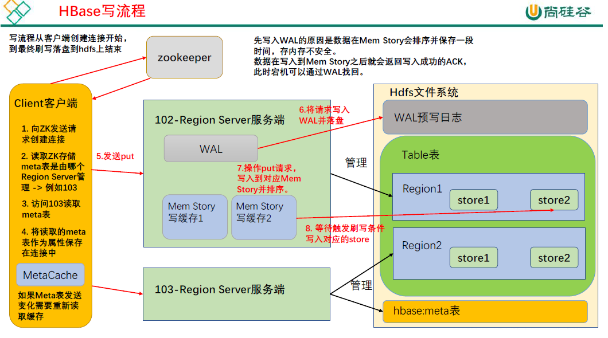

# HMaster

  1) 监控RegionServer
 2) 处理RegionServer故障转移
 3) 处理元数据的变更
 4) 处理region的分配或移除
 5) 在空闲时间进行数据的负载均衡
6) 通过Zookeeper发布自己的位置给客户端

* 实现类为HMaster，负责监控集群中所有的 RegionServer 实例。主要作用如下：
  - （1）管理元数据表格hbase:meta，接收用户对表格创建修改删除的命令并执行
  - （2）监控region 是否需要进行负载均衡，故障转移和region 的拆分。

- 通过启动多个后台线程监控实现上述功能：

  > ①LoadBalancer 负载均衡器
  > 周期性监控region 分布在regionServer 上面是否均衡，由参数hbase.balancer.period 控
  > 制周期时间，默认5 分钟。
  > ②CatalogJanitor 元数据管理器
  > 定期检查和清理hbase:meta 中的数据。meta 表内容在进阶中介绍。
  > ③MasterProcWAL master 预写日志处理器
  > 把master 需要执行的任务记录到预写日志WAL 中，如果master 宕机，让backupMaster读取日志继续干。

# RegionServer

1) 负责存储HBase的实际数据

2) 处理分配给它的Region

3) 刷新缓存到HDFS

4) 维护HLog

5) 执行压缩

6) 负责处理Region分片

# 常见shell命令

## 创建命名空间

```shell
list_namespace	#展示命名空间,也可以搭配正则表达式使用
create_namespace 'ns1'	#创建命名空间
```
---

## DML


```shell
create 'student','info'	#在默认的数据库下创建名为student.列族为info的表
create 'ns1:t1', {NAME => 'f1', VERSIONS => 5},{NAME => 'f2', VERSIONS => 5}	#在ns1命名空间中创建名为t1列族为f1,f2,且维护版本为五个版本的表

alter 't1', NAME => 'f1', VERSIONS => 5	#修改表名为t1,列族名为f1的版本号
alter 'ns1:t1', NAME => 'f1', METHOD => 'delete'	#删除命名空间为ns1,表名为t1,列族为f1的列族
alter 'ns1:t1', 'delete' => 'f1'

disable 't1'	#先禁用表t1
drop	't1'	#再删除t1

put 'ns1:t1', 'r1', 'c1:INFO', 'value'	#往命名空间为ns1,表名为t1,row_key为r1,列族为c1,列名为INFO,添加值为value的数据	#如果添加相同的值,就会覆盖掉之前的数据

get 't1', 'r1'	#获取表格t1,行号为r1的数据
get 't1', 'r1', {COLUMN => 'c1'}

delete 'ns1:t1', 'r1', 'c1', ts1	#删除ns1命名空间下的t1表格中,行号为r1,列族名为c1,时间戳为ts1
```

# JavaAPI

## Connection

```java
package com.kevin;

import org.apache.hadoop.conf.Configuration;
import org.apache.hadoop.hbase.client.Connection;
import org.apache.hadoop.hbase.client.ConnectionFactory;

import java.io.IOException;


public class HBaseConnection {
    //声明一个静态属性
    public static Connection connection = null;

    static {
        try {
            connection = ConnectionFactory.createConnection();
        } catch (IOException e) {
            throw new RuntimeException(e);
        }
    }
    public static void close() throws IOException {
        if (connection != null) {
            connection.close();
        }
    }

    /**
     * 重量级的连接,一个线程最好创建一个,是线程安全的,不建议缓存和池化
     */
    public static void main(String[] args) throws IOException {
        //直接使用静态连接不要再main线程里面单独创建
        System.out.println(HBaseConnection.connection);
        HBaseConnection.close();

    }
}

```

## DDL

```java
package com.kevin;

import org.apache.hadoop.hbase.NamespaceDescriptor;
import org.apache.hadoop.hbase.TableName;
import org.apache.hadoop.hbase.client.*;
import org.apache.hadoop.hbase.protobuf.generated.HBaseProtos;
import org.apache.hadoop.hbase.util.Bytes;

import java.io.IOException;

public class HBaseDDL {

    public static Connection connection = HBaseConnection.connection;

    /**
     * 创建命名空间
     *
     * @param namespace 命名空间名称
     */
    public static void createNameSpace(String namespace) throws IOException {
        //1.获取admin
        //admin的连接是轻量级的,不是线程安全的,不建议池化或者缓存
        Admin admin = connection.getAdmin();
        //2.创建命名空间
        //   代码相对代码更加底层,需要填写一个完整的描述器
        //创建命名空间的建造者
        NamespaceDescriptor.Builder builder = NamespaceDescriptor.create(namespace);
        //给命名空间添加键值对
        builder.addConfiguration("user", "root");
        //使用build构造出对应的对象 完成创建
        try {
            admin.createNamespace(builder.build());
        } catch (IOException e) {
            System.out.println("命名空间已经存在");
            e.printStackTrace();
        }
        //关闭
        admin.close();
    }

    /**
     * 判断表格是否存在
     *
     * @param namespace 命名空间
     * @param tableName 表名
     * @return true表示存在
     */
    public static Boolean isTableExists(String namespace, String tableName) throws IOException {
        Admin admin = connection.getAdmin();

        //使用方法判断表格是否存在
        boolean exists = false;
        try {
            exists = admin.tableExists(TableName.valueOf(namespace, tableName));
        } catch (IOException e) {
            e.printStackTrace();
        }
        return exists;

    }

    /**
     * 创建表格
     *
     * @param namespace      命名空间
     * @param tableName      表名
     * @param columnFamilies 列族
     */
    public static void createTable(String namespace, String tableName, String... columnFamilies) throws IOException {
        //判断是否有至少一个列族
        if(columnFamilies.length==0){
            System.out.println("创建表格至少有一个列族");
            return;
        }
        Admin admin = connection.getAdmin();
        //创建表描述器
        TableDescriptorBuilder tableDescriptorBuilder = TableDescriptorBuilder.newBuilder(TableName.valueOf(namespace, tableName));
        //添加列族参数
        for (String columnFamily : columnFamilies) {
            //创建列族描述
            ColumnFamilyDescriptorBuilder columnFamilyDescriptorBuilder = ColumnFamilyDescriptorBuilder.newBuilder(Bytes.toBytes(columnFamily));
            //添加版本参数
            columnFamilyDescriptorBuilder.setMaxVersions(3);
            tableDescriptorBuilder.setColumnFamily(columnFamilyDescriptorBuilder.build());

        }
        try {
            admin.createTable(tableDescriptorBuilder.build());
        } catch (IOException e) {
            System.out.println("表格存在");
            e.printStackTrace();
        }
        admin.close();


    }

    /**
     * 修改表格中一个列族的版本
     * @param namespace 命名空间
     * @param tableName 表名
     * @param columFamily 列族
     * @param version 版本
     */
    public static void modifyTable(String namespace,String tableName,String columFamily,int version) throws IOException {

        if (!isTableExists(namespace,tableName)) {
            System.out.println("表格不存在");
            return;
        }
        Admin admin = connection.getAdmin();
        //获取表格描述
        TableDescriptor tableDescriptor = admin.getDescriptor(TableName.valueOf(namespace, tableName));
        //创建表格描述
        //  表格描述建造者
        TableDescriptorBuilder tableDescriptorBuilder = TableDescriptorBuilder.newBuilder(tableDescriptor);
        //修改
        //创建一个列族描述
        ColumnFamilyDescriptorBuilder columnFamilyDescriptorBuilder = ColumnFamilyDescriptorBuilder.newBuilder(Bytes.toBytes(columFamily));
        columnFamilyDescriptorBuilder.setMaxVersions(version);
        //创建列族描述
        tableDescriptorBuilder.modifyColumnFamily(columnFamilyDescriptorBuilder.build());
        //修改表格
        admin.modifyTable(tableDescriptorBuilder.build());
        //关闭连接
        admin.close();

    }

    /**
     * 删除表
     * @param namespace 命名空间
     * @param tableName 表名
     * @return true 删除成功
     */
    public static Boolean deleteTable(String namespace,String tableName) throws IOException {
        if (!isTableExists(namespace,tableName)) {
            System.out.println("表格不存在");
            return false;
        }
        Admin admin = connection.getAdmin();
        TableName tableName1 = TableName.valueOf(namespace, tableName);
        admin.disableTable(tableName1);
        admin.deleteTable(tableName1);
        admin.close();
        return true;
    }


    public static void main(String[] args) throws IOException {
        //测试创建命名空间
//        createNameSpace("zkw");
//        System.out.println(">>>>>>>>>");
//        createTable("zkw", "test", "c1");
//        System.out.println(">>>>>>>>>");
//        isTableExists("zkw","test");
//        System.out.println(">>>>>>>>>");
//        deleteTable("zkw", "test");
//        HBaseConnection.connection.close();
    }
}

```

## DML

```java
package com.kevin;

import org.apache.hadoop.hbase.Cell;
import org.apache.hadoop.hbase.CellUtil;
import org.apache.hadoop.hbase.CompareOperator;
import org.apache.hadoop.hbase.TableName;
import org.apache.hadoop.hbase.client.*;
import org.apache.hadoop.hbase.filter.ColumnValueFilter;
import org.apache.hadoop.hbase.filter.FilterList;
import org.apache.hadoop.hbase.filter.SingleColumnValueFilter;
import org.apache.hadoop.hbase.util.Bytes;

import java.io.IOException;

public class HBaseDML {
    public static Connection connection = HBaseConnection.connection;

    /**
     * 插入数据
     *
     * @param namespace    命名空间
     * @param tableName    表名
     * @param rowKey       主键
     * @param columnFamily 列族
     * @param column       列名
     * @param value        值
     */
    public static void putCell(String namespace, String tableName, String rowKey, String columnFamily, String column, String value) throws IOException {
        //获取table
        Table table = connection.getTable(TableName.valueOf(namespace, tableName));
        //调用相关的方法插入数据
        //创建put对象
        Put put = new Put(Bytes.toBytes(rowKey));
        //添加数据
        put.addColumn(Bytes.toBytes(columnFamily), Bytes.toBytes(column), Bytes.toBytes(value));
        try {
            table.put(put);
        } catch (IOException e) {
            throw new RuntimeException(e);
        }
        //关闭table
        table.close();
    }

    /**
     * 读取数据
     *
     * @param namespace    命名空间
     * @param tableName    表名
     * @param rowKey       主键
     * @param columnFamily 列族
     * @param column       列名
     */
    public static void getCells(String namespace, String tableName, String rowKey, String columnFamily, String column) throws IOException {
        //获取table对象
        Table table = connection.getTable(TableName.valueOf(namespace, tableName));
        //创建get方法
        Get get = new Get(Bytes.toBytes(rowKey));
        //添加对应的参数获取信息
        get.addColumn(Bytes.toBytes(columnFamily), Bytes.toBytes(column));
        //获取版本
        get.readAllVersions();
        //读某一列的数据
        Result result = table.get(get);
        //处理数据
        Cell[] cells = result.rawCells();
        //直接打印测试数据
        for (Cell cell : cells) {
            String value = new String(CellUtil.cloneValue(cell));
            System.out.println(value);
        }
        table.close();

    }

    /**
     * 扫描数据
     *
     * @param namespace 命名空间
     * @param tableName 表名
     * @param startRow  开始的row 包含
     * @param endRow    结束的row 不包含
     */
    public static void scanRows(String namespace, String tableName, String startRow, String endRow) throws IOException {
        //获取table
        Table table = connection.getTable(TableName.valueOf(namespace, tableName));
        //创建scan对象
        Scan scan = new Scan();
        //添加范围
        scan.withStartRow(Bytes.toBytes(startRow));
        scan.withStopRow(Bytes.toBytes(endRow));
        //读取多条数据获取scanner
        ResultScanner scanner = null;
        try {
            scanner = table.getScanner(scan);
        } catch (IOException e) {
            e.printStackTrace();
        }
        assert scanner != null;
        for (Result result : scanner) {
            Cell[] cells = result.rawCells();
            for (Cell cell : cells) {
                String value = new String(CellUtil.cloneValue(cell));
                System.out.print(value);
            }
        }
        table.close();
    }

    /**
     * 带过滤的扫描
     *
     * @param namespace    命名空间
     * @param tableName    表名
     * @param startRow     开始row
     * @param endRow       结束row
     * @param columnFamily 列族名称
     * @param column       列名
     * @param value        值
     */
    public static void filterScan(String namespace, String tableName, String startRow, String endRow, String columnFamily, String column, String value) throws IOException {
        //获取table
        Table table = connection.getTable(TableName.valueOf(namespace, tableName));
        //创建scan对象
        Scan scan = new Scan();
        //添加范围
        scan.withStartRow(Bytes.toBytes(startRow));
        scan.withStopRow(Bytes.toBytes(endRow));
        //(1)单列数据过滤扫描 添加过滤条件
        FilterList filterList = new FilterList();
        //过滤条件
        ColumnValueFilter columnValueFilter = new ColumnValueFilter(
                Bytes.toBytes(columnFamily),
                Bytes.toBytes(column),
                CompareOperator.EQUAL,
                Bytes.toBytes(value)
        );
        //过滤列表添加过滤条件
        filterList.addFilter(filterList);

        //(2)整行数据过滤保留没有当前列的数据
        SingleColumnValueFilter singleColumnValueFilter = new SingleColumnValueFilter(
                Bytes.toBytes(columnFamily),
                Bytes.toBytes(column),
                CompareOperator.EQUAL,
                Bytes.toBytes(value)

        );
        filterList.addFilter(singleColumnValueFilter);


        //scan添加过滤列表
        scan.setFilter(filterList);
        //读取多条数据获取scanner
        ResultScanner scanner = null;
        try {
            scanner = table.getScanner(scan);
        } catch (IOException e) {
            e.printStackTrace();
        }
        assert scanner != null;
        for (Result result : scanner) {
            Cell[] cells = result.rawCells();
            for (Cell cell : cells) {
                String val = new String(CellUtil.cloneValue(cell));
                System.out.print(val);
            }
        }
        table.close();
    }

    /**
     * 删除数据
     *
     * @param namespace    命名空间
     * @param tableName    表名
     * @param rowKey       主键
     * @param columnFamily 列族名称
     * @param column       列名
     */
    public static void deleteColumn(String namespace, String tableName, String rowKey, String columnFamily, String column) throws IOException {

        Table table = connection.getTable(TableName.valueOf(namespace, tableName));

        Delete delete = new Delete(Bytes.toBytes(rowKey));
        //删除一个版本 delete.addColumn()
        //删除所有版本 delete.addColumns()
        delete.addColumn(Bytes.toBytes(columnFamily), Bytes.toBytes(column));
        try {
            table.delete(delete);
        } catch (IOException e) {
            e.printStackTrace();
        }
        table.close();
    }

}

```

# HMaster架构



### Meta 表格介绍:

全称 hbase：meta，只是在list 命令中被过滤掉了，本质上和HBase 的其他表格一样。

* RowKey：([table],[region start key],[region id]) 即 表名，region 起始位置和regionID。

* 列：

  info：regioninfo 为region 信息，存储一个HRegionInfo 对象。
  info：server 当前region 所处的RegionServer 信息，包含端口号。
  info：serverstartcode 当前region 被分到RegionServer 的起始时间。
  如果一个表处于切分的过程中，即region 切分，还会多出两列info：splitA 和info：splitB，
  存储值也是HRegionInfo 对象，拆分结束后，删除这两列。

# RegionServer 架构



# 写流程



 
